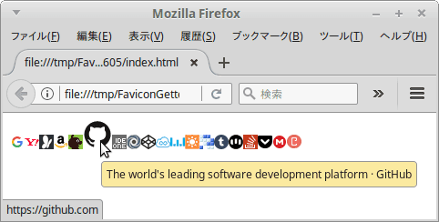

# このソフトウェアについて

ファビコン・コレクター。URLからファビコンを取得しDBに保存する。HTMLに出力することで一覧できる。

ファイル|説明
--------|----
`url.txt`|対象URLファイル。
`FileLoader.py`|`url.txt`からファビコン等を取得しDBに登録する。
`IndexHtmlWriter.py`|DBにあるファビコン等からHTMLファイルを出力する。
`index.html`|ファビコンが一覧できる。

URL、タイトル、ファビコンをDBに登録する。

# 開発環境

* Linux Mint 17.3 MATE
* Python 3.4.3
* インターネット接続環境

# 実行してみる

```sh
$ bash run.sh
```

規定のブラウザが立ち上がってファビコンが一覧できる。

# こまかい手順

## 1. `url.txt`をつくる

1. ファビコンを取得したいURLを1行ずつ書く

ドメインまでのURLがあればOK。

## 2. `FileLoader.py`を実行する

```sh
$ python3 FileLoader.py
```

URLの数が多いと時間がかかる。

## 3. `IndexHtmlWriter.py`を実行する

```sh
$ python3 IndexHtmlWriter.py
```

`index.html`, `favicon.css`, が出力される。

## 4. `index.html`をブラウザで開いて閲覧する



* クリックするとURLに飛ぶ
* マウスオーバーで拡大表示される

# さらに細かい使い方

アクセス方法、データ取り扱い方法を3パターンから選べる。

メソッド|概要
--------|----
`InsertGet`|DBに存在しなければネットから取得する。（デフォルト）
`Upsert`|ネットから取得し存在しなければDBへ挿入。存在すればファビコン等を更新する。
`InsertRevision`|古いファビコンもDBに保存する。

`FileLoader.py`ファイルの以下部分。

```python
                self.__db_access.InsertGet(line)
#                self.__db_access.Upsert(line)
#                self.__db_access.InsertRevision(line)
```

上記コードのうちどれか一つを選ぶ。他は`#`でコメントアウトする。

# ライセンス

このソフトウェアはCC0ライセンスである。

[](http://creativecommons.org/publicdomain/zero/1.0/deed.ja)

なお、使用させていただいたライブラリは以下のライセンスである。感謝。

Library|License|Copyright
-------|-------|---------
[requests](http://requests-docs-ja.readthedocs.io/en/latest/)|[Apache-2.0](https://opensource.org/licenses/Apache-2.0)|[Copyright 2012 Kenneth Reitz](http://requests-docs-ja.readthedocs.io/en/latest/user/intro/#requests)
[bs4](https://www.crummy.com/software/BeautifulSoup/bs4/doc/)|[MIT](https://opensource.org/licenses/MIT)|[Copyright © 1996-2011 Leonard Richardson](https://pypi.python.org/pypi/beautifulsoup4),[参考](http://tdoc.info/beautifulsoup/)
[dataset](https://dataset.readthedocs.io/en/latest/)|[MIT](https://opensource.org/licenses/MIT)|[Copyright (c) 2013, Open Knowledge Foundation, Friedrich Lindenberg, Gregor Aisch](https://github.com/pudo/dataset/blob/master/LICENSE.txt)

